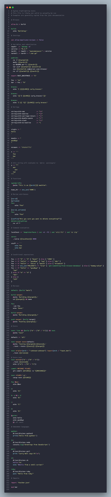

# vscode-just


[](https://gitmoji.dev)

VSCode syntax highlighting extension for the [just](https://github.com/casey/just) language.

Contents:

-   [Features](#features)
-   [Known Issues](#known-issues)
-   [Release Notes](#release-notes)
-   [Roadmap](#roadmap)
-   [Contributing](#contributing)
-   [References](#references)

## Features

Basic syntax highlighting for `just` files:

-   Comments
-   Variable assignment and settings
-   Strings & interpolation blocks
-   Recipes: recipe attributes, names, params and dependencies
-   Keywords, constants and operators
-   Some embedded languages

Note: Unlike previous iterations of VSCode `just` extensions, this extension does not provide command running capabilities from VSCode.



## Known Issues

This extension does simple and/or best effort syntax highlighting. It is not intended to be 100% comprehensive, but rather provide a good enough experience for most users. That being said, if you find a bug or missing feature, please open an issue or a pull request.


#### Nesting and scoping

Since expressions can have deep nesting and we cannot tell the scope based on indentation or other markers, we run into the following issues. These are limitations of TextMate grammars and is not easily fixable. 
  
-  Expression and recipe specific rules pollute the global repository scopes, meaning we apply `just` highlighting within recipe bodies. This means `just` keywords/operators/etc, like `if`, will highlight everywhere. This is necessary to highlight expressions correctly elsewhere.

- Some nested expressions will break due to lack of awareness of depth and preemptively match a closing character. Ex. 

    ```
    echo {{ '{{ string }}' }}
    ```

    will echo `{{ string }}` since braces within the string are escaped and part of the string's scope. Textmate can't handle this without a full parser, so will match on the first closing brace it finds.

- Line breaking and expressions that span multiple lines may not highlight correctly. As a simple example

    ```
    foo param1 \
        param2='foo':
    echo {{param1}} {{param2}}
    ```

#### Publishing

This extension is not available on open source marketplaces (for now). If you are using an open source build of VSCode, you might need to install the extension manually. To do so:

1. Navigate to the latest [release](https://github.com/nefrob/vscode-just/releases) and download the `.vsix` file.
2. Copy the file to your `.vscode/extensions` directory.
3. Install via the command line: `code --install-extension .vscode/extensions/vscode-just-X.Y.Z.vsix`

## Release Notes

See [CHANGELOG.md](CHANGELOG.md).

## Roadmap

### 2024

Outstanding:

- [ ] Update to match [just grammar](https://github.com/casey/just/blob/43d88f50e02057e5d91602ef4ffdd0ddfc094099/GRAMMAR.md) more accurately
- [ ] Fix escaping within strings
- [ ] Publish to [open source marketplaces](https://open-vsx.org/)

Completed:

- [x] Initial release
- [x] Update with new `just` releases
- [x] Migrate to `yaml` grammar for composability and readability
- [x] Add snapshot testing


### Beyond

-   Semantic highlighting / LSP

    To avoid implementing a parser for files, it would be ideal for `just` to expose the AST or other APIs for editor extensions to leverage. This would allow for more advanced features like semantic highlighting, code folding, and more. 

    If VSCode works to support tree-sitter, [that](https://github.com/IndianBoy42/tree-sitter-just) would be a possible alternative.

## Contributing

See [CONTRIBUTING.md](CONTRIBUTING.md).

## References

-   [ TextMate Language Grammars](https://macromates.com/manual/en/language_grammars)

-   Previous iterations on `just` syntax grammars

    -   [shellock/vscode-just](https://github.com/skellock/vscode-just)
    -   [sclu1034/vscode-just](https://github.com/sclu1034/vscode-just/)

-   [Example language grammars](https://github.com/microsoft/vscode-textmate/tree/09effd8b7429b71010e0fa34ea2e16e622692946/test-cases/themes/syntaxes)

-   [Just manual](https://just.systems/man/en/)

-   [Packaging and publishing extensions](https://code.visualstudio.com/api/working-with-extensions/publishing-extension)
