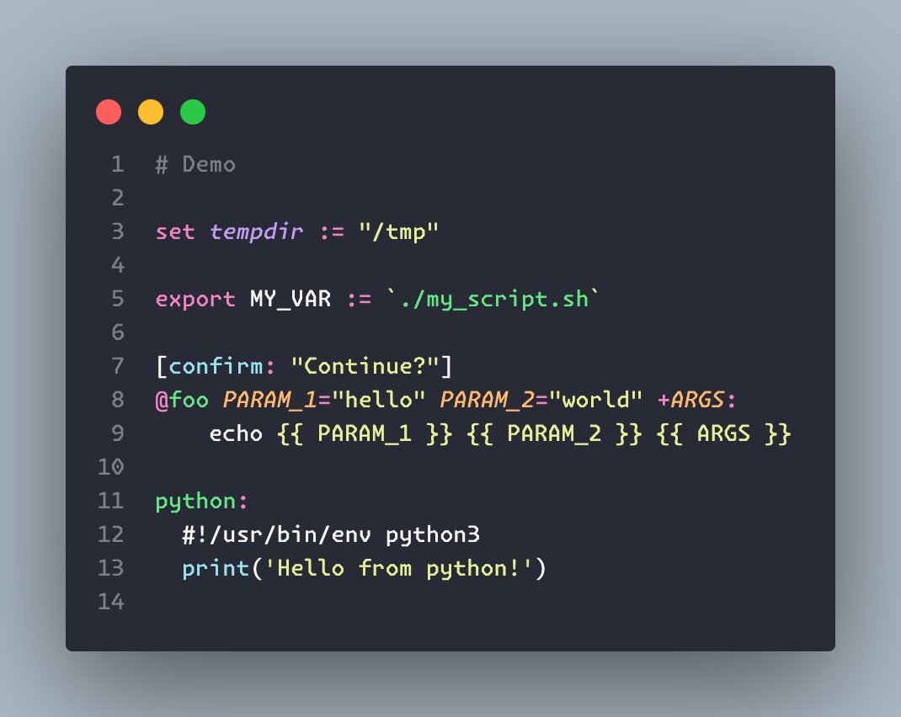

# vscode-just

VSCode syntax highlighting extension for the [just](https://github.com/casey/just) language.

Note: the extension is currently in **pre-release** on the VSCode Marketplace for testing. When installing the extension, use the dropdown menu to select the pre-release option for now, otherwise you will get an error.

Contents:

-   [Features](#features)
-   [Known Issues](#known-issues)
-   [Release Notes](#release-notes)
-   [Roadmap](#roadmap)
-   [Contributing](#contributing)
-   [References](#references)

## Features

Basic syntax highlighting for just files:

-   Comments
-   Variable assignment and settings
-   Strings & escaped blocks
-   Recipes: recipe attributes, names, params and dependencies
-   Some keywords, constants and operators
-   Some embedded languages

Note: Unlike previous iterations of this extension, this extension does not provide command running capabilities from VSCode.

## Known Issues

This extension does simple and/or best effort syntax highlighting. It is not intended to be 100% comprehensive, but rather provide a good enough experience for most users. An LSP solution would be an alternative future approach. That being said, if you find a bug or missing feature, please open an issue or a pull request.

-   Escaping within a string, e.g. `"{{ variable }}"`, colors all non-match content as a string. Ideally non-match content should look like plain text in this case but I am unsure how to remove highlighting forced by the surrounding string. For consistency, I opted to always have escaped content colored as a string, whether the block is within a string or not.

## Release Notes

See [CHANGELOG.md](CHANGELOG.md).

## Roadmap

### 2024

-   Fix escaping within strings
-   Migrate to `yaml` grammar for composability and readability
-   Update to match [just grammar](https://github.com/casey/just/blob/43d88f50e02057e5d91602ef4ffdd0ddfc094099/GRAMMAR.md) more accurately
-   Update with new `just` releases

### Beyond

-   Semantic highlighting / LSP

    To avoid implementing a parser for files, it would be ideal for `just` to expose the AST or other APIs for editor extensions to leverage.

## Contributing

See [CONTRIBUTING.md](CONTRIBUTING.md).

## References

-   [ TextMate Language Grammars](https://macromates.com/manual/en/language_grammars)

-   Previous iterations on `just` syntax grammars

    -   [shellock/vscode-just](https://github.com/skellock/vscode-just)
    -   [sclu1034/vscode-just](https://github.com/sclu1034/vscode-just/)

-   [Example language grammars](https://github.com/microsoft/vscode-textmate/tree/09effd8b7429b71010e0fa34ea2e16e622692946/test-cases/themes/syntaxes)

-   [Just manual](https://just.systems/man/en/)

-   [Packaging and publishing extensions](https://code.visualstudio.com/api/working-with-extensions/publishing-extension)
